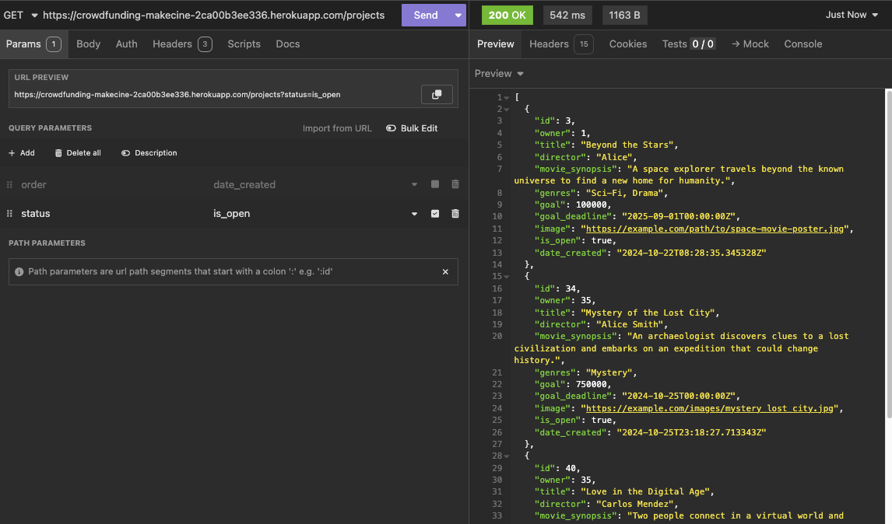
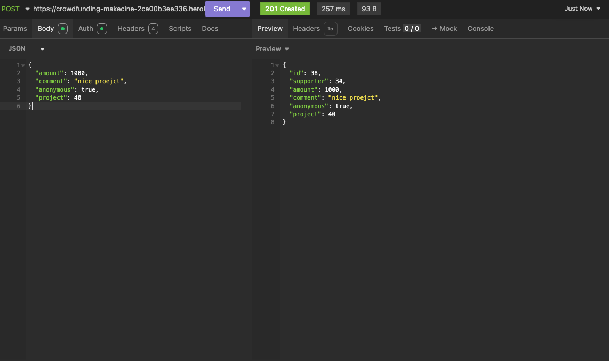

# Crowdfunding Back End

MakeCine
https://crowdfunding-makecine-2ca00b3ee336.herokuapp.com/

## Planning:

### Concept/Name

This is a platform for independent movie directors.
They can introduce their films and receive funding from the public.

### Intended Audience

- Movie directors or staff
- Movie fans who loves independent movies
- Investors

### User Story

- As a movie director/staff, I want to promote my new movie and gather funding from people who are passionate about supporting independent films so that I can bring my vision to life.

- As a movie fan, I want to find cool, unique movies that may not be well-known and support them financially, so I can help these projects succeed and enjoy exclusive content or rewards.

- As a movie investor, I want to discover promising and original movie projects that stand out from mainstream productions, so I can invest in creative ventures with the potential for growth and financial return.

### Front End Pages/Functionality

- Homepage
  1. Nav bar
  - Sign up/ login button on the nav bar.
  - Create projects button.
  2. Landing page
  - Display all projects.
  - Button for project detail.
  - Progress bar goal of pledges and how much pledges has been made so far.
- Project detail
  - Show the onwer of project.
  - Show details of project such as content, title...
  - Funding deadline.
  - Progress bar goal of pledges and how much pledges has been made so far.
  - History of the pledges.
  - Button for donate.
  - Button for updating (only owner)
- Error handling page
  - Login is required
  - Unauthorized such as not project owner or admin
  - Bad request such as missing field.

### API Spec

| URL                    | HTTP METHOD | PURPOSE                 | REQUEST BODY   | SUCCESS RESPONSE CODE | Autnetication/Authorisation                        |
| ---------------------- | ----------- | ----------------------- | -------------- | --------------------- | -------------------------------------------------- |
| /projects/             | GET         | Display all projects    | N/A            | 200                   | N/A                                                |
| /projects/:id          | GET         | Return a project by id  | N/A            | 200                   | N/A                                                |
| /projects?is_open=True | GET         | Return projects is open | N/A            | 200                   | N/A                                                |
| /projects/             | POST        | Create a new project    | Project object | 201                   | Login required                                     |
| /projects/:id          | PUT         | Update the prject       | Project object | 200                   | Login required /Must be the project owner or admin |
| /projects/:id          | DELETE      | Delete the project      | N/A            | 204                   | Login required /Must be the project owner or admin |
|                        |             |                         |                |                       |                                                    |
| /pledges/              | GET         | Return all pledges      | N/A            | 200                   | Only Admin                                         |
| /pledges/:id           | GET         | Return a pledge by id   | N/A            | 200                   | N/A                                                |
| /pledges/              | POST        | Create a pledge         | Pledges object | 201                   | Login required                                     |
| /pledges/:id           | PUT         | Update a pledge         | Pledges object | 200                   | Login required /Must be the project owner or admin |
| /pledges/:id           | DELETE      | Delete the pledge by id | N/A            | 204                   | Login required /Must be the project owner or admin |
|                        |             |                         |                |                       |                                                    |
| /users/                | GET         | Returns all users       | N/A            | 200                   | Only Admin                                         |
| /users/:id             | GET         | Return a user by id     | N/A            | 200                   | Login required /useritself or admin                |
| /users/                | POST        | Sign up                 | User object    | 201                   | N/A                                                |
| /users/login           | POST        | Login                   | User object    | 200                   | N/A                                                |
| /users/:id             | PUT         | Update the user by id   | User object    | 200                   | Login required /useritself or superuser            |
| /users/:id             | DELETE      | Delete the user by id   | N/A            | 204                   | Login required /useritself or superuser            |

### DB Schema

### Screenshots - Basic features

1. Get projects by latest / Get projects that are open

2. Get project by id

3. Create a project

4. Update a project

5. Get pledges

6. Create a pledge

7. Update a pledge

8. Get users

9. Create a user

10. Update a user

11. Authentication/Authorization

### Screenshots -Extra features

1. A user is trying to create a pledge when the project is not open

2. The owner of a project is attempting to create a pledge for themselves.

3. A user is trying to create a pledge after the project has reached its goal.

4. A user is trying to create a pledge that exceeds the remaining goal amount.

